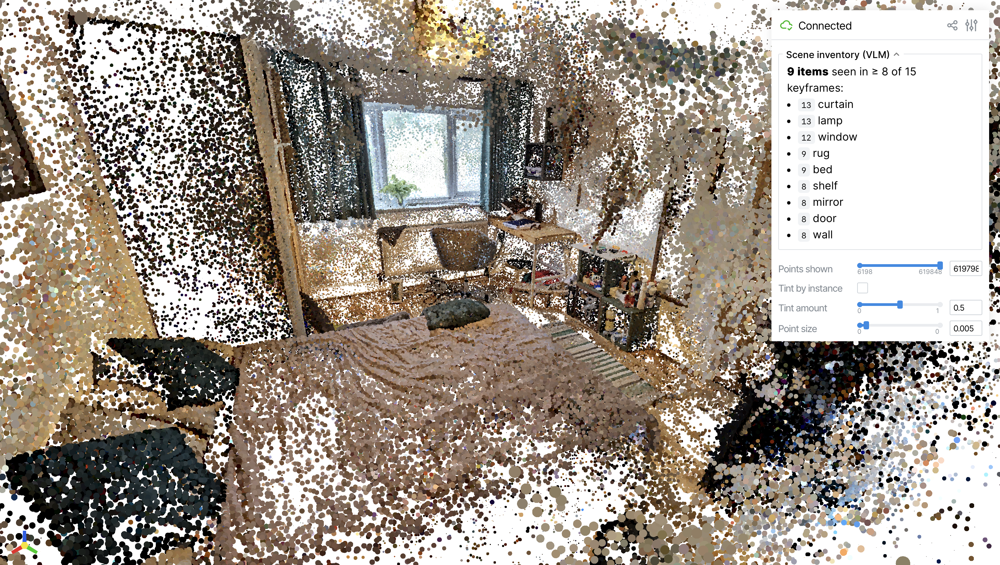

# WorldMind — phone video → 3D Gaussian splat

I built WorldMind so I can drop in a phone-shot video of a room and get
back a trained 3D Gaussian splat I can open in a web viewer or drop into
[PlayCanvas SuperSplat](https://playcanvas.com/supersplat). No manual
frame extraction, no COLMAP wrestling, no Nerfstudio CLI to learn.

| Trained splat (SuperSplat) | Custom in-browser viewer (this repo) |
|---|---|
|  |  |

The phone capture that fed both — [`room5.mp4`](https://github.com/AfthabShiraz/WorldMind/releases/download/v0.1-room5/room5.mp4) (~45 s, 297 MB):

<video src="https://github.com/AfthabShiraz/WorldMind/releases/download/v0.1-room5/room5.mp4" controls></video>

```
video.mp4
   ↓  make run VIDEO=video.mp4
   ↓  (frames → COLMAP poses → splatfacto training → .ply export)
outputs/<scene>/ply_full/splat.ply        ←  drag into SuperSplat
                                              or:  make view SCENE=<scene>
```

---

## 🎥 View the example scene (`room5`)

I've included one finished example: `room5`, a bedroom-with-workspace
I captured on my phone and trained for ~30k iterations. The trained
splat lives as a [GitHub release asset](https://github.com/AfthabShiraz/WorldMind/releases/tag/v0.1-room5)
(~150 MB) — the source code is in this repo, the artifact is one click away.

### Option A — Zero-install (drag-and-drop)

1. Download [`splat.ply` from the v0.1-room5 release](https://github.com/AfthabShiraz/WorldMind/releases/download/v0.1-room5/splat.ply).
2. Open [PlayCanvas SuperSplat](https://playcanvas.com/supersplat/editor) in any browser.
3. Drag `splat.ply` onto the page. Mouse-drag to orbit, scroll to zoom, right-click-drag to pan.

No git clone, no Python, no GPU required.

### Option B — My custom in-browser viewer

This shows the actual viewer code I wrote, with the scene-inventory panel
populated from the VLM run (description + objects + spatial relations).
Two commands:

```bash
# Lightweight: just enough to view (viser + plyfile + numpy)
make install-viewer

# Auto-downloads the .ply from the release, opens localhost:8080
make view-example
```

Open the printed URL (`http://localhost:8080` if local, or add
`EXTRA=--share` to `make view-example` to get a public
`*.share.viser.studio` link a remote reviewer can click).

> `make install-viewer` runs `pip install -r requirements-viewer.txt`
> against whatever python is on your PATH. If you'd rather use my full
> conda training env, run `make install` instead — `make view-example`
> works with either.

---

## 🚀 Run the pipeline on your own video

**Prerequisites:** an NVIDIA GPU. I pinned the repo to my Blackwell GB10
(see *Stack* below). For amd64 + recent CUDA my conda env should just
work; for other architectures expect to retune `TORCH_CUDA_ARCH_LIST`.

### One-time setup (~10 min for the training env, ~30 s for viewer-only)

```bash
# Full env — required for training your own scene
make install      # installs miniforge + conda env at ~/miniforge3
make env-check    # proves GPU + torch + gsplat + colmap + nerfstudio work

# Lightweight env — sufficient for just viewing .ply files
make install-viewer
```

### Per-video (~10 min on GB10)

```bash
make run VIDEO=/path/to/your_clip.mp4
```

That single command:

1. Copies your video to `data/raw/<scene>.mp4`.
2. Extracts frames + runs COLMAP (focal-length seeded — works on phone videos with no EXIF).
3. Trains splatfacto for ~30 000 iterations.
4. Exports the result to `outputs/<scene>/ply_full/splat.ply`.
5. Renders 6 preview JPGs to `outputs/<scene>/_qc/renders_full/` so you can sanity-check the result over SSH without a browser.

Scene name defaults to the video filename. Override with `SCENE=`:

```bash
make run VIDEO=~/clip.mp4 SCENE=living_room        # custom name
make run VIDEO=~/clip.mp4 PROFILE=smoke            # 5k iters (~1 min) instead of 30k
```

### View your scene

```bash
make view SCENE=<your_scene>                       # localhost:8080
make view SCENE=<your_scene> EXTRA=--share         # public URL, anyone can open
```

Or download `outputs/<your_scene>/ply_full/splat.ply` and drop into SuperSplat.

---

## 📋 All commands

```bash
make help                                          # list every target
make install                                       # full env (training + viewer)
make install-viewer                                # lightweight env (viewer only)
make env-check                                     # verify full env

# Main pipeline
make run VIDEO=path/to/clip.mp4 [SCENE=name]       # video → .ply (full)
make view SCENE=<name> [EXTRA=--share]             # in-browser viewer
make fetch-example                                 # download room5 .ply from release
make view-example                                  # auto-fetch + view room5

# Per-stage (debugging / re-running one step)
make process-data SCENE=<name> [EXTRA=--force]     # frames + COLMAP only
make qc-process-data SCENE=<name>                  # exit-criteria check
make train-full SCENE=<name>                       # training only
make train-smoke SCENE=<name>                      # 5k-iter quick check
make export-splat SCENE=<name>                     # checkpoint → .ply

make clean-scene SCENE=<name>                      # wipe derived artifacts (keeps data/raw)
```

### Filming tips (what I've learned affects every stage downstream)

- **Slow, steady pan.** Motion blur is the #1 reason COLMAP drops frames for me.
- **Overlap.** Every spot in the room should appear in many frames from many angles.
- **Texture matters.** Blank walls break feature matching — I keep furniture, posters, clutter in frame.
- **One smooth sweep.** ~30–60 s of footage is plenty for a small room.
- **No moving people / pets.** They cause floaters in the splat.

---

## Where things end up

```
data/raw/<scene>.<ext>                   your input video (gitignored)
data/scenes/<scene>/
    images/                              extracted frames
    colmap/sparse/0/                     COLMAP reconstruction
    transforms.json                      Nerfstudio dataset descriptor
outputs/<scene>/
    splatfacto_full/.../                 training run dir (checkpoints)
    ply_full/splat.ply                   ← the artifact you want
    _qc/renders_full/                    6 preview JPGs for SSH sanity-checks
```

`data/` and `outputs/` are gitignored — they're regenerated from the input video.

---

## Stack

I built this on my **NVIDIA DGX Spark** (Ubuntu 24.04 aarch64, **GB10
GPU**, compute capability `sm_121`, CUDA 13.0). The env is pinned for
that target.

| Layer | Version | Reason |
|---|---|---|
| Python | 3.10 | Nerfstudio's best-tested version |
| Torch | 2.9.1+cu129 (aarch64) | Earliest stable torch whose `arch_list` covers `sm_120` (PTX-forward to GB10's `sm_121`) |
| Torchvision | 0.24.1 | ABI-matched to torch |
| Nerfstudio | 1.1.5 | `splatfacto` + `ns-process-data` + `.ply` export |
| gsplat | 1.4.0 | Nerfstudio's rasteriser; JIT-compiles against host nvcc on first import |
| COLMAP | 4.0.4 (conda-forge `cuda_129/linux-aarch64`) | CUDA SIFT matching |
| viser | (pip) | In-browser viewer (`make view`) |

`scripts/install_env.sh` encodes all of this; `environment.lock.txt` is
my `pip freeze` from a known-good install. My full design rationale is
in [`docs/IMPLEMENTATION_PLAN.md`](docs/IMPLEMENTATION_PLAN.md).

---

## Semantic layer

On top of the geometric splat, I generate a structured description of
what the room contains. The in-browser viewer renders this as the
**Scene inventory** panel.

### What I ship: scene-level inventory

`make scene-inventory SCENE=<name>` (which also runs automatically as
stage 4 of `make run`) samples 15 keyframes from the scene and calls
**Qwen2.5-VL-3B** three different ways:

1. **Per-frame object + relation extraction.** For each keyframe I ask
   Qwen for a list of `<object> <relation> <other_object>` phrases
   (e.g. `book on desk`, `chair next to desk`). I parse the output
   into triples with a longest-match regex over the allowed relation
   set (`on, in, under, next to, behind, above, …`).
2. **Cross-frame aggregation.** I count how many keyframes each object
   name and each `(object, relation, anchor)` triple appears in. Items
   below an auto-threshold (~⅓ of keyframes) get filtered out — that's
   my noise-rejection step. I also dedup at the frame level so the
   same chair doesn't get counted twice within one keyframe.
3. **Whole-room description.** I send four evenly-spaced keyframes to
   Qwen in *one* multi-image call and ask for one flowing paragraph:
   what type of room, the major furniture, and how things are arranged.
   This is the only step where the model sees multiple views at once,
   which is why the output reads as a coherent layout description
   rather than a list. Example for `room5`:

   > *A wooden desk sits against the wall under a window, cluttered
   > with various items including a notebook, a lamp, and a pair of
   > scissors. To the right of the desk is a small, open shelf filled
   > with personal care products and a mirror reflecting part of the
   > room. Further to the right, there is a bed with a wooden
   > nightstand next to it, topped with a lamp and some books. The
   > floor is covered with a striped rug…*

Everything lands in `semantics/<scene>/scene_inventory.json` (counts,
relations, per-frame triples, and the paragraph). My viewer reads that
file and renders three sections in the GUI panel — description,
objects, relations.

This is **scene-level**, not per-Gaussian: the splat geometry is
unchanged. The semantic layer is a sidecar file you can throw away and
regenerate.

### What I tried first and abandoned: per-Gaussian 3D labels

Before I settled on the scene-level inventory above, I tried four
different ways to attach labels to specific points in the splat. The
code for each is still in the repo as an opt-in experiment
(`make lift-semantics-v2`, `make place-labels`), but I left all of
them out of `make run`:

- **v1: bake labels into splat colours.** I SAM-segmented each
  keyframe, labelled each mask with Qwen, projected Gaussians into
  masks and voted. Output was a new `.ply` with Gaussian colours
  replaced by a per-label palette. The problem: it destroyed the
  appearance of the splat to display semantics — I got one or the
  other, never both.
- **v2: depth-aware instance lifting, sidecar files.** Same SAM → Qwen
  → project-and-vote idea, but I added depth filtering so Gaussians
  behind walls didn't get votes from foreground masks, and cross-view
  mask association so the same chair seen from 10 angles collapsed to
  one instance. The splat stayed untouched; instance IDs lived in a
  sidecar `.npy`. Better than v1 but I was still asking Qwen to label
  each cropped mask in isolation — without scene context, a sofa
  cushion came back as "sandwich", a radiator as "knife". My
  cross-view consensus pass helped but didn't fully fix it.
- **Option A: VLM grounding + back-projection.** I dropped SAM
  entirely. For each strongly-seen inventory object, I asked Qwen for
  a bounding box per keyframe, took the bbox centre, and back-projected
  to 3D via a splat z-buffer depth proxy, then clustered across views.
  I added three safety filters (local Gaussian density, scene-relative
  depth cap, scene AABB containment) which successfully prevented the
  worst failure mode — labels flying through a window into the
  distance. But the bbox centre often hit the wrong surface (label
  landing on the floor beside the chair instead of the chair seat).
- **Option A v2: ray triangulation.** Same VLM grounding, but each
  detection became a 3D *ray* from the camera through the bbox centre
  instead of a 3D point. Per object, I solved an iteratively-reweighted
  least-squares system to find the 3D point where the rays converge,
  with Cauchy weights downweighting outliers. The anchors landed
  accurately (residuals 1-3% of scene diagonal — chair landed on
  chair, radiator on radiator). But objects with multiple real
  instances (the room has two curtains on different walls) got dropped
  because the rays couldn't converge to one point.

The honest takeaway from all of this: an open-vocabulary 3B-parameter
VLM does well at "what's in this room" but not at "where exactly is
each thing in 3D". Grounding accuracy degrades sharply on tight crops
and multi-instance scenes. My scene-level inventory works because the
VLM is operating where it's strongest — full-frame description, with
multi-frame aggregation doing the noise rejection.
